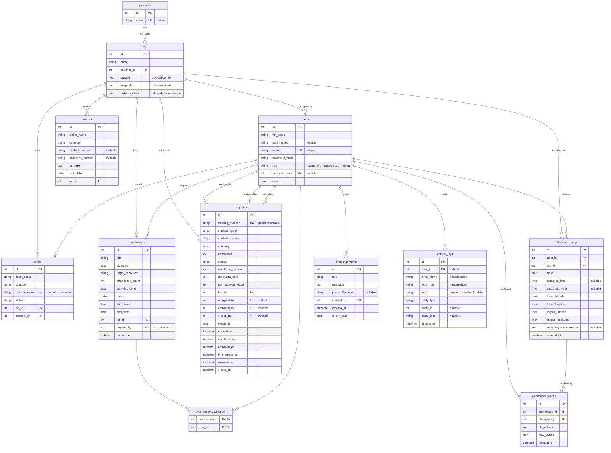

# OPELSS Entity Relationship Diagram

The OPELSS database schema — 12 tables. Generated from the SQLAlchemy models in
`app/models/`, so it reflects the schema the application actually creates.

- **Production:** Azure Database for PostgreSQL
- **Local development:** SQLite (`instance/app.db`)

---

## Diagram

---

## Tables

### `provinces`
The top of the location hierarchy. A province contains many labs.

| Column | Type | Notes |
| --- | --- | --- |
| `id` | Integer | Primary key. |
| `name` | String(120) | Unique. |

### `labs`
An e-learning lab centre. Carries the geo-fence used for attendance.

| Column | Type | Notes |
| --- | --- | --- |
| `id` | Integer | Primary key. |
| `name` | String(120) | |
| `province_id` | Integer | → `provinces.id`. |
| `latitude` / `longitude` | Float | Centre point of the clock-in geo-fence. |
| `radius_meters` | Float | How far from that point a clock-in is accepted. |

### `users`
Staff accounts. The `role` column drives authorisation throughout the system.

| Column | Type | Notes |
| --- | --- | --- |
| `id` | Integer | Primary key. |
| `full_name` | String(120) | Shown as the facilitator/actor name. |
| `staff_number` | String(8) | Nullable. |
| `email` | String(120) | Unique; the login identifier. |
| `password_hash` | String(255) | Werkzeug hash — never a plaintext password. |
| `role` | String(50) | `Admin`, `HQ Trainee` or `Lab Trainee`. |
| `assigned_lab_id` | Integer | → `labs.id`. Nullable. Scopes a Lab Trainee to one lab and enables clock-in. |
| `active` | Boolean | Inactive users cannot log in. |

### `assets`
Equipment register per lab.

| Column | Type | Notes |
| --- | --- | --- |
| `id` | Integer | Primary key. |
| `asset_name` | String(120) | |
| `category` | String(100) | |
| `serial_number` | String(120) | Unique — the UNISA tag number. |
| `status` | String(50) | Condition/availability. |
| `lab_id` | Integer | → `labs.id`. |
| `created_by` | Integer | → `users.id`. |

### `visitors`
Visitor log per lab.

| Column | Type | Notes |
| --- | --- | --- |
| `id` | Integer | Primary key. |
| `visitor_name` | String(120) | |
| `category` | String(100) | |
| `student_number` | String(8) | Nullable. |
| `cellphone_number` | String(20) | Nullable. |
| `purpose` | Text | |
| `visit_date` | Date | |
| `lab_id` | Integer | → `labs.id`. |

> Note: unlike the other registers, `visitors` has no `created_by` column.

### `programmes`
Community programmes run at a lab.

| Column | Type | Notes |
| --- | --- | --- |
| `id` | Integer | Primary key. |
| `title` | String(200) | |
| `objective` | Text | |
| `target_audience` | String(200) | |
| `attendance_count` | Integer | |
| `activities_done` | Text | |
| `date` | Date | |
| `start_time` / `end_time` | Time | |
| `lab_id` | Integer | → `labs.id`. |
| `created_by` | Integer | → `users.id`. Who **captured** the record. |
| `created_at` | DateTime | SAST. |

### `programme_facilitators`
Join table linking programmes to the users who **ran** them.

| Column | Type | Notes |
| --- | --- | --- |
| `programme_id` | Integer | → `programmes.id`. Part of composite primary key. |
| `user_id` | Integer | → `users.id`. Part of composite primary key. |

This is the audit trail of *who facilitated* a programme. It is deliberately separate from
`programmes.created_by`, which only records who typed the record in — the two are often
different people, and a programme can have several facilitators.

### `enquiries`
Student enquiries escalated from a lab to HQ.

| Column | Type | Notes |
| --- | --- | --- |
| `id` | Integer | Primary key. |
| `tracking_number` | String(30) | Unique. Given to the student for the public tracker. |
| `student_name` / `student_number` | String | The student who raised it. |
| `category` | String(120) | |
| `description` | Text | |
| `status` | String(50) | `Open`, `Assigned`, `In Progress`, `Resolved`, `Not Resolved`, `Closed`. |
| `escalation_reason` | Text | Why the lab could not resolve it. |
| `resolution_note` | Text | How it was resolved. |
| `not_resolved_reason` | Text | Why it could not be resolved. |
| `lab_id` | Integer | → `labs.id`. Where it was raised. |
| `assigned_to` | Integer | → `users.id`. The HQ Trainee handling it. |
| `assigned_by` | Integer | → `users.id`. The Admin who assigned it. |
| `closed_by` | Integer | → `users.id`. |
| `escalated` | Boolean | |
| `created_at`, `escalated_at`, `assigned_at`, `in_progress_at`, `resolved_at`, `closed_at` | DateTime | One timestamp per workflow transition. |

`users` is referenced three times from this table (`assigned_to`, `assigned_by`, `closed_by`),
which is why the diagram shows three separate lines between them.

### `attendance_logs`
One row per user per day, with the geolocation captured at each end.

| Column | Type | Notes |
| --- | --- | --- |
| `id` | Integer | Primary key. |
| `user_id` | Integer | → `users.id`. |
| `lab_id` | Integer | → `labs.id`. |
| `date` | Date | SAST calendar date. |
| `clock_in_time` / `clock_out_time` | Time | Nullable — an open shift has no clock-out yet. |
| `login_latitude` / `login_longitude` | Float | Where the clock-in happened. |
| `logout_latitude` / `logout_longitude` | Float | Where the clock-out happened. |
| `early_departure_reason` | Text | Required when leaving before the scheduled end. |
| `created_at` | DateTime | SAST. |

### `attendance_audits`
Change history for attendance records, so corrections stay accountable.

| Column | Type | Notes |
| --- | --- | --- |
| `id` | Integer | Primary key. |
| `attendance_id` | Integer | → `attendance_logs.id`. |
| `changed_by` | Integer | → `users.id`. |
| `old_values` / `new_values` | JSON | Snapshot before and after the change. |
| `timestamp` | DateTime | |

### `announcements`
Notices shown on the public landing page until they expire.

| Column | Type | Notes |
| --- | --- | --- |
| `id` | Integer | Primary key. |
| `title` | String(200) | |
| `message` | Text | |
| `poster_filename` | String(255) | Nullable. Image in `UPLOAD_FOLDER`. |
| `created_by` | Integer | → `users.id`. |
| `created_at` | DateTime | |
| `expiry_date` | Date | Hidden from the landing page after this date. |

### `activity_logs`
System-wide audit log of create/update/delete activity.

| Column | Type | Notes |
| --- | --- | --- |
| `id` | Integer | Primary key. |
| `user_id` | Integer | → `users.id`. Nullable. |
| `actor_name` / `actor_role` | String | Copied at write time, so the log stays readable even if the user is later renamed or deleted. |
| `action` | String(20) | `created`, `updated`, `deleted`. |
| `entity_type` | String(50) | e.g. `programme`, `asset`, `enquiry`. |
| `entity_id` | Integer | Nullable — the record acted on. |
| `entity_label` | String(255) | Human-readable description of the record. |
| `timestamp` | DateTime | SAST. |

---

## Notes

**Lab scoping.** Every operational table (`assets`, `visitors`, `programmes`, `enquiries`,
`attendance_logs`) carries a `lab_id`. This is what lets a Lab Trainee be restricted to their
own lab while Admin and HQ Trainee see everything.

**Who did it vs who recorded it.** `created_by` answers "who typed this in".
`programme_facilitators` answers "who actually ran it". Reports and audits need the second,
which is why the join table exists.

**Timestamps are SAST.** Datetime columns store South African Standard Time via `sast_now()`,
not UTC — the server runs in UTC but users are in South Africa.

**Cascade.** `attendance_logs` are deleted with their user (`cascade="all, delete-orphan"`).
Other relationships do not cascade.

---

## Related documentation

- [API documentation](api-documentation.md)
- [Permissions matrix](permissions-matrix.md)
- [Project README](../README.md)
