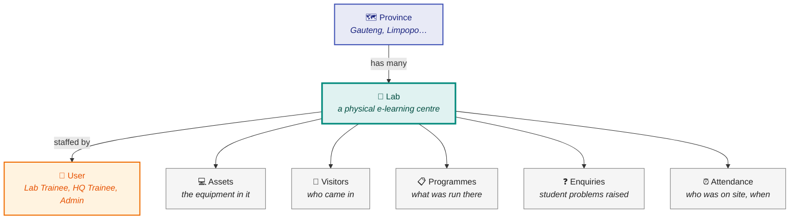
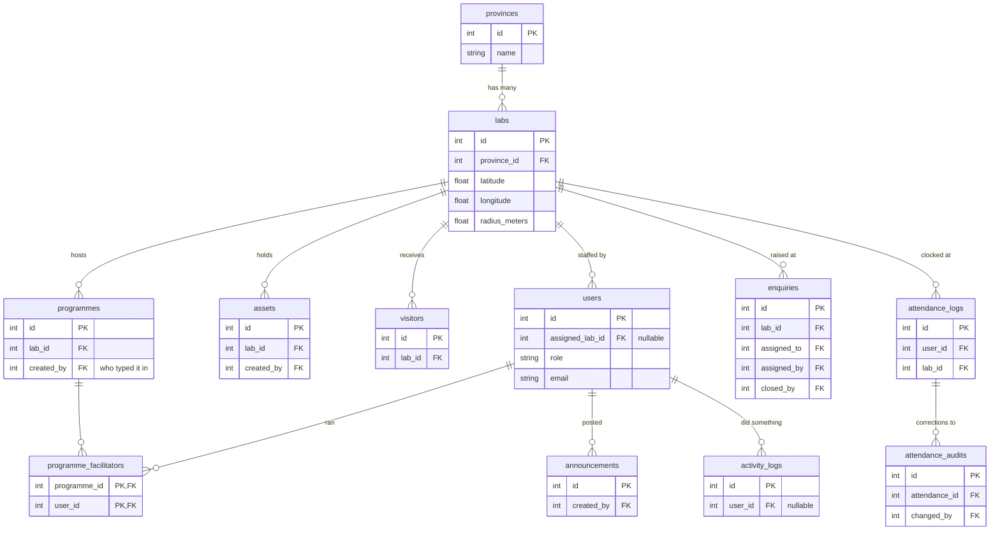
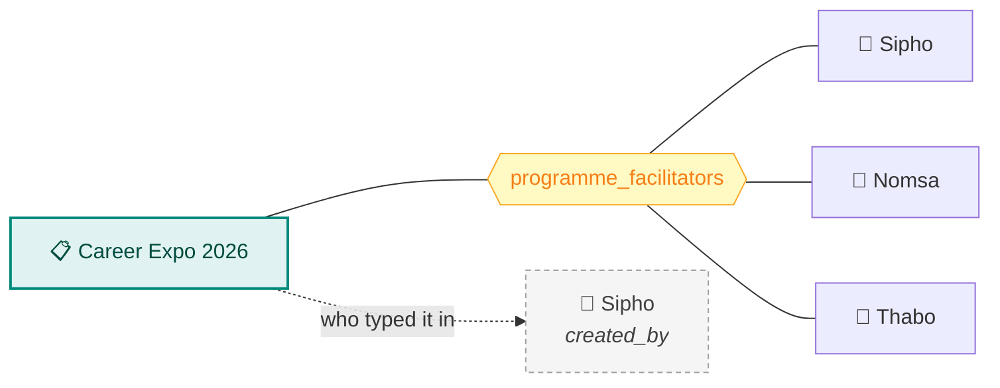

# OPELSS Database

How the data fits together, and why it is shaped this way.

---

## The shape of it, in one sentence

**Everything hangs off a lab.**

A province contains labs. A lab has equipment, visitors, programmes, enquiries and attendance.
A user belongs to a lab. That single fact — every operational record carries a `lab_id` — is
what makes the whole permission model work: a Lab Trainee sees only rows whose `lab_id` matches
their own.

Read it as: *"a **Province** has many **Labs**; a **Lab** is staffed by **Users** and is where
assets, visitors, programmes, enquiries and attendance all happen."*

---

## The relationships that matter

Now the same thing with the joins made explicit. Only the keys are shown — the full column list
for each table is [further down](#every-table-in-detail), because you rarely need both at once.

### Three relationships worth explaining

**1. A programme has many facilitators — and that is the point.**

`programmes.created_by` records **who captured the record**. The `programme_facilitators` join
table records **who actually ran the programme** — often several people, often not the person who
typed it in. Reporting and audits need the second, which is exactly why the join table exists
rather than a single `facilitator_id` column.

**2. `users` is joined to `enquiries` three separate times.**

An enquiry can point at three different people: the HQ Trainee handling it (`assigned_to`), the
Admin who gave it to them (`assigned_by`), and whoever eventually closed it (`closed_by`). Three
foreign keys, all to `users` — that is why the diagram shows three lines between them.

**3. Attendance keeps its own history.**

`attendance_audits` stores a JSON before-and-after snapshot every time an attendance record is
corrected, plus who changed it. Attendance is the accountability record, so a silent edit would
defeat the purpose.

---

## Every table in detail

<b>provinces</b> — the top of the location hierarchy

| Column | Type | Notes |
| --- | --- | --- |
| `id` | Integer | Primary key. |
| `name` | String(120) | Unique. |

<b>labs</b> — a physical centre, and the geo-fence around it

| Column | Type | Notes |
| --- | --- | --- |
| `id` | Integer | Primary key. |
| `name` | String(120) | |
| `province_id` | Integer | → `provinces.id` |
| `latitude`, `longitude` | Float | Centre of the clock-in geo-fence. |
| `radius_meters` | Float | How far from that point a clock-in is still accepted. |

The seeded "Main Lab" sits at `0, 0` with a 1000 m radius — see the
[README](../README.md#️-you-cannot-log-in-as-a-lab-trainee-without-faking-your-location) for why
that matters locally.

<b>users</b> — staff accounts; <code>role</code> drives everything

| Column | Type | Notes |
| --- | --- | --- |
| `id` | Integer | Primary key. |
| `full_name` | String(120) | Shown as the facilitator/actor name. |
| `staff_number` | String(8) | Nullable. |
| `email` | String(120) | Unique — the login identifier. |
| `password_hash` | String(255) | Werkzeug hash. Never plaintext. |
| `role` | String(50) | `Admin`, `HQ Trainee`, `Lab Trainee`. |
| `assigned_lab_id` | Integer | → `labs.id`, nullable. Scopes a Lab Trainee, and enables clock-in. |
| `active` | Boolean | Inactive users cannot log in. |

<b>assets</b> — the equipment register

| Column | Type | Notes |
| --- | --- | --- |
| `id` | Integer | Primary key. |
| `asset_name` | String(120) | |
| `category` | String(100) | |
| `serial_number` | String(120) | Unique — the UNISA tag number. |
| `status` | String(50) | Condition / availability. |
| `lab_id` | Integer | → `labs.id` |
| `created_by` | Integer | → `users.id` |

<b>visitors</b> — who came into the lab

| Column | Type | Notes |
| --- | --- | --- |
| `id` | Integer | Primary key. |
| `visitor_name` | String(120) | |
| `category` | String(100) | UNISA Student, Educator, Learner, Other. |
| `student_number` | String(8) | Nullable — only for students. |
| `cellphone_number` | String(20) | Nullable. |
| `purpose` | Text | |
| `visit_date` | Date | |
| `lab_id` | Integer | → `labs.id` |

Unlike the other registers, visitors has **no `created_by`** — you cannot tell from the schema
who logged a visitor.

<b>programmes</b> — community programmes run at a lab

| Column | Type | Notes |
| --- | --- | --- |
| `id` | Integer | Primary key. |
| `title` | String(200) | |
| `objective` | Text | |
| `target_audience` | String(200) | |
| `attendance_count` | Integer | |
| `activities_done` | Text | |
| `date` | Date | |
| `start_time`, `end_time` | Time | |
| `lab_id` | Integer | → `labs.id` |
| `created_by` | Integer | → `users.id` — who **captured** it. |
| `created_at` | DateTime | SAST. |

<b>programme_facilitators</b> — who actually ran it

| Column | Type | Notes |
| --- | --- | --- |
| `programme_id` | Integer | → `programmes.id`, part of the composite primary key. |
| `user_id` | Integer | → `users.id`, part of the composite primary key. |

A join table, so one programme can credit many facilitators. The composite key stops the same
person being added twice.

<b>enquiries</b> — student problems escalated to HQ

| Column | Type | Notes |
| --- | --- | --- |
| `id` | Integer | Primary key. |
| `tracking_number` | String(30) | Unique — what the student uses on the public tracker. |
| `student_name`, `student_number` | String | Who raised it. |
| `category` | String(120) | |
| `description` | Text | |
| `status` | String(50) | Open → Assigned → In Progress → Resolved / Not Resolved → Closed. |
| `escalation_reason` | Text | Why the lab could not solve it. |
| `resolution_note` | Text | How it was solved. |
| `not_resolved_reason` | Text | Why it could not be. |
| `lab_id` | Integer | → `labs.id` — where it was raised. |
| `assigned_to` | Integer | → `users.id` — the HQ Trainee handling it. |
| `assigned_by` | Integer | → `users.id` — the Admin who assigned it. |
| `closed_by` | Integer | → `users.id` |
| `escalated` | Boolean | |
| `created_at`, `escalated_at`, `assigned_at`, `in_progress_at`, `resolved_at`, `closed_at` | DateTime | One timestamp per transition, so you can measure how long each step took. |

<b>attendance_logs</b> — one row per person per day

| Column | Type | Notes |
| --- | --- | --- |
| `id` | Integer | Primary key. |
| `user_id` | Integer | → `users.id` |
| `lab_id` | Integer | → `labs.id` |
| `date` | Date | SAST calendar date. |
| `clock_in_time`, `clock_out_time` | Time | Nullable — an open shift has no clock-out yet. |
| `login_latitude`, `login_longitude` | Float | Where they clocked in. |
| `logout_latitude`, `logout_longitude` | Float | Where they clocked out. |
| `early_departure_reason` | Text | Required when leaving before the scheduled end. |
| `created_at` | DateTime | SAST. |

Deleted along with the user (`cascade="all, delete-orphan"`). Nothing else cascades.

<b>attendance_audits</b> — the history of corrections

| Column | Type | Notes |
| --- | --- | --- |
| `id` | Integer | Primary key. |
| `attendance_id` | Integer | → `attendance_logs.id` |
| `changed_by` | Integer | → `users.id` |
| `old_values`, `new_values` | JSON | Before-and-after snapshot. |
| `timestamp` | DateTime | |

<b>announcements</b> — notices on the public landing page

| Column | Type | Notes |
| --- | --- | --- |
| `id` | Integer | Primary key. |
| `title` | String(200) | |
| `message` | Text | |
| `poster_filename` | String(255) | Nullable — image in `UPLOAD_FOLDER`. |
| `created_by` | Integer | → `users.id` |
| `created_at` | DateTime | |
| `expiry_date` | Date | Disappears from the landing page after this. |

<b>activity_logs</b> — the system-wide audit trail

| Column | Type | Notes |
| --- | --- | --- |
| `id` | Integer | Primary key. |
| `user_id` | Integer | → `users.id`, nullable. |
| `actor_name`, `actor_role` | String | **Copied in at write time**, on purpose. |
| `action` | String(20) | `created`, `updated`, `deleted`. |
| `entity_type` | String(50) | `programme`, `asset`, `enquiry`… |
| `entity_id` | Integer | Nullable — the record acted on. |
| `entity_label` | String(255) | Human-readable description of it. |
| `timestamp` | DateTime | SAST. |

`actor_name` and `actor_role` are duplicated here rather than joined from `users`. That is
deliberate: if a user is later renamed or deleted, the audit trail must still say who did the
thing at the time.

---

## Conventions

**Times are SAST.** Every `DateTime` is written with `sast_now()` from `app/utils.py`, not UTC.
The server runs in UTC; the people using it do not.

**Where the schema comes from.** The models in `app/models/` are the source of truth.
`db.create_all()` runs at startup and creates missing tables — which is why a fresh clone works
with no migration step. It cannot alter existing tables, so **adding a column needs an Alembic
migration**; adding a whole new table does not (but write one anyway).

**12 tables**, and this document covers all of them.

---

→ [Permissions matrix](permissions-matrix.md) · [API documentation](api-documentation.md) · [README](../README.md)
