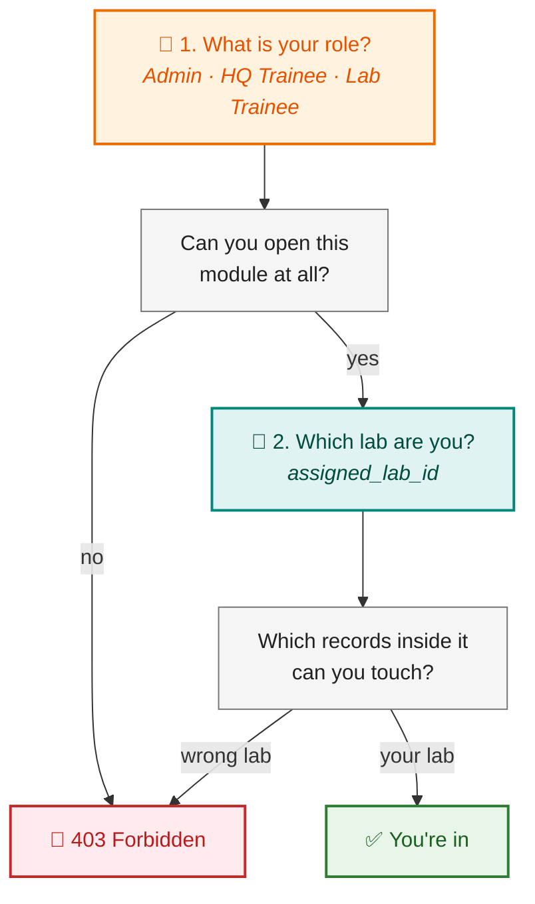

# Who Can Do What

The three OPELSS roles, what each is for, and exactly where the boundaries are.

Everything here is taken from the actual checks in the code, so it describes what the system
**enforces** — which is not always what you would assume.

---

## The idea in one picture

Access is decided by **two questions, in order**:



**Role** decides whether you can reach a page. **Lab** decides which rows on it are yours.

An Admin and a Lab Trainee can both open the Assets page — but the Lab Trainee only ever sees
their own lab's equipment. That is the whole model.

---

## The three roles

### 🔧 Lab Trainee — runs one lab

The person on the ground. Their world is **one lab, and only that lab**.

They clock in when they arrive, log the visitors who come in, keep the equipment register
current, record the programmes they run, and escalate student problems they cannot solve.

They **cannot** export to Excel, see another lab, open the reports page, or reach admin.

### 🗂️ HQ Trainee — watches every lab

The person at head office. They see **everything, everywhere**, but change very little.

They monitor all labs, filter across provinces, pull exports and reports, post announcements,
and work the enquiries handed to them.

They **cannot** create users, change labs, assign enquiries, or see the audit log.

### 👑 Admin — runs the system

Everything an HQ Trainee can do, plus the controls: users, roles, labs, provinces, geo-fences,
password resets, the full enquiry workflow, and the audit log.

### 🌐 The public — no account at all

Students never log in. They can read announcements on the landing page and check an enquiry
using the reference number their lab gave them. Nothing else.

---

## The matrix

**✅** yes · **🔸** yes, but only their own lab · **⚠️** yes, with a condition · **—** 403

| | 🔧 Lab Trainee | 🗂️ HQ Trainee | 👑 Admin | 🌐 Public |
| --- | :---: | :---: | :---: | :---: |
| **Getting in** | | | | |
| Landing page, announcements | ✅ | ✅ | ✅ | ✅ |
| Track an enquiry by reference | — | — | — | ✅ |
| Log in | ⚠️ geo-fenced | ✅ | ✅ | — |
| Change own password | ✅ | ✅ | ✅ | — |
| **Attendance** | | | | |
| Clock in / out | ⚠️ | ⚠️ | ⚠️ | — |
| Own PDF timesheet | ✅ | ✅ | ✅ | — |
| **The registers** | | | | |
| View assets / visitors / programmes | 🔸 | ✅ | ✅ | — |
| Add, edit, delete them | 🔸 | ✅ | ✅ | — |
| Filter by lab or province | — | ✅ | ✅ | — |
| Export to Excel | — | ✅ | ✅ | — |
| **Enquiries** | | | | |
| View | 🔸 | ✅ | ✅ | — |
| Raise / escalate | ✅ | — | — | — |
| Edit or delete | ⚠️ 🔸 | — | — | — |
| Assign / reassign | — | — | ✅ | — |
| Start / resolve / not-resolved | — | ⚠️ | ✅ | — |
| Close / reopen | — | — | ✅ | — |
| **The rest** | | | | |
| Reports | — | ✅ | ✅ | — |
| Announcements — create / manage | — | ✅ | ✅ | — |
| Users, labs, provinces | — | — | ✅ | — |
| Audit log | — | — | ✅ | — |

### The ⚠️ conditions, spelled out

**Lab Trainee login is geo-fenced.** The browser sends coordinates and the server refuses the
login unless they are inside the lab's `radius_meters`. Admins and HQ Trainees are not
geo-fenced.

**Clock in/out has no role check at all.** It is guarded by login plus having an assigned lab —
nothing more. Because the seeded Admin *is* given a lab, an Admin can clock in. See
[worth a second look](#two-things-worth-a-second-look).

**Lab Trainee edit/delete of an enquiry only works while it is still `Open`.** The moment it is
assigned, the lab loses the ability to change it — sensible, since HQ is now working on it.

**HQ Trainee start/resolve only works on enquiries assigned to them.** They cannot pick up
someone else's. An Admin can act on any enquiry.

---

## Enquiries: the one flow where roles hand off

This is the only place where all three roles touch the same record in turn, so it is worth
seeing end to end.

```mermaid
flowchart LR
    S["🌐 Student<br/><i>has a problem</i>"]
    O["Open"]
    A["Assigned"]
    P["In Progress"]
    R["Resolved /<br/>Not Resolved"]
    C["Closed"]

    S -->|"tells the lab"| O
    O -->|"👑 Admin assigns"| A
    A -->|"🗂️ HQ starts"| P
    P -->|"🗂️ HQ finishes"| R
    R -->|"👑 Admin closes"| C

    style S fill:#f5f5f5,stroke:#757575,color:#212121
    style O fill:#e3f2fd,stroke:#1565c0,color:#0d47a1
    style A fill:#e8eaf6,stroke:#3f51b5,color:#1a237e
    style P fill:#fff3e0,stroke:#ef6c00,color:#e65100
    style R fill:#e8f5e9,stroke:#2e7d32,color:#1b5e20
    style C fill:#eceff1,stroke:#455a64,color:#263238
```



- **🔧 Lab Trainee** raises it. *Only* they can — HQ and Admin cannot create an enquiry.
- **👑 Admin** assigns it to someone, and later closes or reopens it.
- **🗂️ HQ Trainee** does the actual work, but only on their own assignments.
- **🌐 Student** watches from the public tracker with their reference number, no login.

Every transition is timestamped (`assigned_at`, `in_progress_at`, `resolved_at`, `closed_at`),
so you can measure how long each step took.

---

## How it is enforced in code

There are two mechanisms, and which one is used tells you something.

**A decorator, when the rule is just "which role".**

```python
@admin_bp.route("/users", methods=["POST"])
@login_required
@role_required("Admin")          # nothing else to think about
def add_user():
    ...
```

Used by admin, audit and announcements.

**An in-view check, when the rule depends on the record.**

```python
if current_user.role == "Lab Trainee" and programme.lab_id != current_user.assigned_lab_id:
    abort(403)                    # you're allowed in, just not to *this* row
```

Used by assets, visitors, programmes and enquiries — because a Lab Trainee *is* allowed on the
page; the question is only which rows.

Both end in **403**.

---

## Two things worth a second look

These are recorded because they are what the code does, not because they are necessarily right.

**1. Attendance has no role guard.**

Clock-in, clock-out and the timesheet are protected by `login_required` alone. What actually
stops most people is that they have no `assigned_lab` — but that is a side effect, not a rule.
The seeded Admin *does* have a lab, so an Admin can clock in and out like a trainee. If
attendance is meant to be Lab-Trainee-only, it needs an explicit check.

**2. Only Lab Trainees can edit or delete an enquiry.**

Not Admins. Not HQ Trainees. They can move an enquiry through the workflow but cannot correct a
typo in it. This may well be deliberate — the lab owns the record it raised — but it is unusual
enough to be worth a decision rather than an assumption.

---

→ [API documentation](api-documentation.md) — the routes behind each of these · [ERD](erd.md) — where `role` and `assigned_lab_id` live · [README](../README.md)
